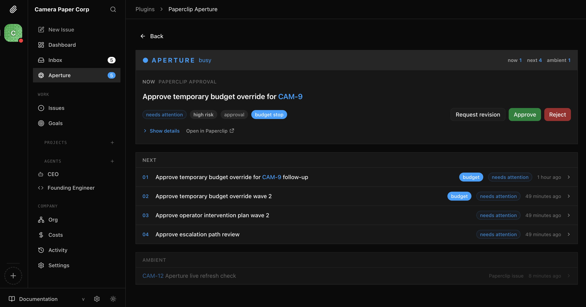

# Paperclip Aperture

**An Aperture-powered attention surface for Paperclip.**



`paperclip-aperture` is a Paperclip plugin that treats Paperclip as the host runtime and UI shell, while importing [`@tomismeta/aperture-core`](https://www.npmjs.com/package/@tomismeta/aperture-core) as the judgment engine.

It turns Paperclip approvals, issue activity, and other operator-facing events into an Aperture-style attention view:

`Paperclip events -> plugin mapper -> Aperture judgment -> Paperclip UI`

Links:

- Aperture core on npm: [`@tomismeta/aperture-core`](https://www.npmjs.com/package/@tomismeta/aperture-core)
- Aperture GitHub repo: [tomismeta/aperture](https://github.com/tomismeta/aperture)
- Paperclip GitHub repo: [paperclipai/paperclip](https://github.com/paperclipai/paperclip)

## What This Plugin Is

This repo is intentionally separate from the Paperclip monorepo.

The architecture is host-first:

- host/runtime: Paperclip
- judgment engine: Aperture
- plugin artifact: `@tomismeta/paperclip-aperture`

The goal is to prove that Aperture can live inside Paperclip as a normal plugin, without changing Aperture core.

## Current Product Shape

What is real in this repo today:

- a real Paperclip plugin repo, not a Paperclip core patch
- embedded `@tomismeta/aperture-core` inside the plugin worker
- a Paperclip event-to-Aperture mapping layer
- a company-scoped attention page
- a dashboard widget
- a sidebar entry
- approval handling, including budget-specific approval semantics
- tests covering the main event loop and approval mapping paths

## Repo Structure

```text
src/
  manifest.ts
  worker.ts
  aperture/
    core-store.ts
    event-mapper.ts
    response-mapper.ts
    types.ts
  handlers/
    actions.ts
    data.ts
    events.ts
    shared.ts
  ui/
    index.tsx
```

## Development

```bash
pnpm install
pnpm typecheck
pnpm build
pnpm dev
pnpm test
```

This repo currently snapshots `@paperclipai/plugin-sdk` and `@paperclipai/shared` from a local Paperclip checkout into `.paperclip-sdk/` for development.

Before publishing this plugin package itself, those should be switched to published Paperclip package versions when available.

## Install Into Paperclip

Build the plugin:

```bash
cd /path/to/paperclip-aperture
pnpm install
pnpm build
```

Then install it into a local Paperclip instance by path:

```bash
curl -X POST http://127.0.0.1:3100/api/plugins/install \
  -H "Content-Type: application/json" \
  -d '{"packageName":"/absolute/path/to/paperclip-aperture","isLocalPath":true}'
```

## Why This Exists

Paperclip already has the host pieces:

- agent workflows
- approvals
- operator UI surfaces
- plugin lifecycle and event subscriptions

Aperture already has the judgment piece:

- deciding what deserves attention now
- what should wait until next
- what should stay ambient

This plugin is the bridge between those two systems.

## Status

This is a working integration prototype.

It is ready for review as:

- a plugin architecture pattern
- an embedded Aperture judgment path inside Paperclip
- an alternative operator attention surface

It should not yet be framed as fully production-hardened or complete.
